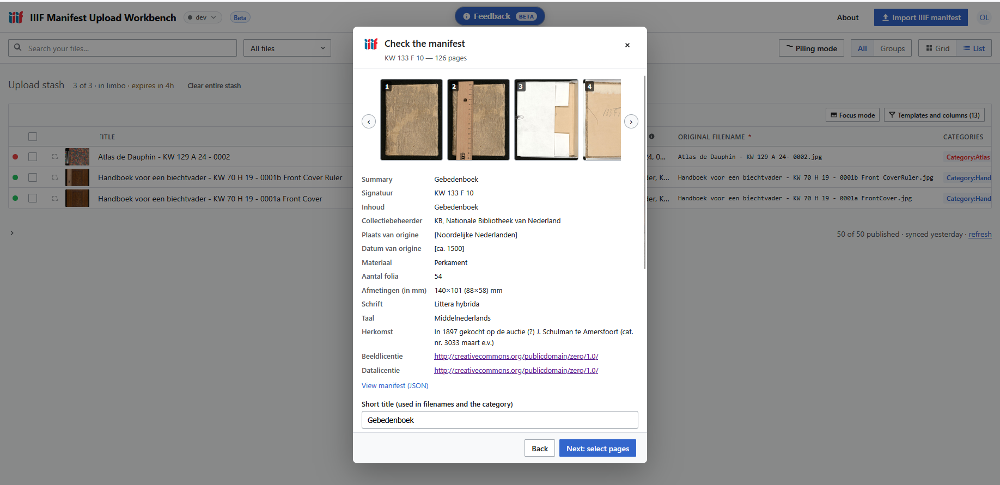
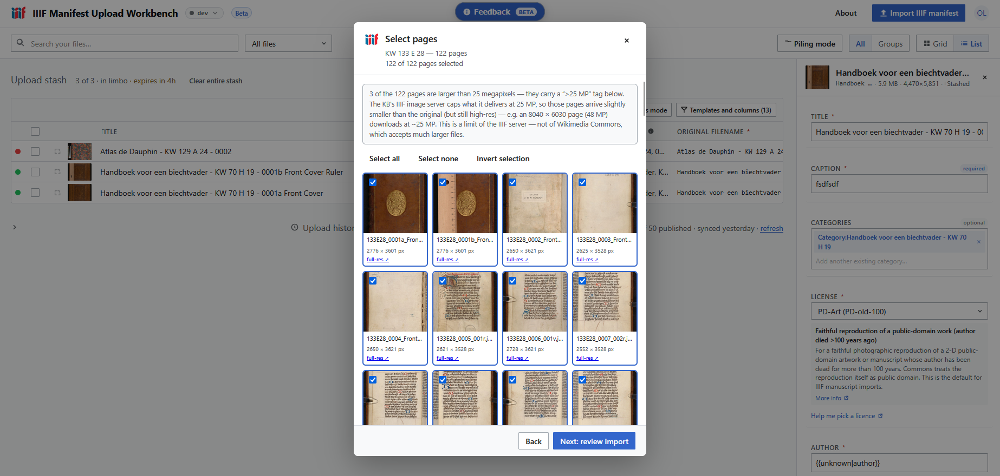

# IIIF Manifest Upload Workbench

Turn **IIIF Presentation manifests** into **Wikimedia Commons uploads** — starting with the medieval manuscripts of the [KB, national library of the Netherlands](https://www.kb.nl/).

Paste a manifest URL (or drop the JSON), review the extracted metadata and page images, and publish them to Commons with prefilled `{{Artwork}}` wikitext, structured data, categories, and duplicate detection — all from a spreadsheet-style workbench in the browser.

**Status: in development.** The approved design and build plan live in [`__inputs/iiif-ingestor-design.md`](__inputs/iiif-ingestor-design.md). Not yet deployed anywhere; local development only.

## Screenshots

<!--
  Screenshot gallery. To add one:
  1. Drop the PNG in docs/screenshots/ — name it after its place in the flow,
     e.g. wizard-01-import.png, wizard-04-confirm.png, workbench-01-table.png
     (the NN keeps the gallery in walkthrough order).
  2. Copy one <details> block below and adjust the summary + path + caption.
  Keep every block collapsed-by-default except the first, so the README stays scannable.
-->

<details open>
<summary><strong>Check the manifest</strong> — metadata review with thumbnail carousel (KW 133 F 10, Gebedenboek)</summary>
<br>



*Manifest loaded from a URL: full-canvas thumbnail carousel, all parsed metadata fields, a "View manifest (JSON)" inspector, and the editable short title that drives filenames and the category.*

</details>

<details>
<summary><strong>Select pages</strong> — per-page selection with native resolutions (KW 133 E 28, Gebedenboek)</summary>
<br>



*Every canvas as a selectable tile with its native dimensions and a full-res link; pages above the IIIF server's 25-megapixel delivery cap are flagged. Imported pages land as ordinary stash rows in the workbench behind the modal.*

</details>

## What it does (when finished)

1. **Ingest** a IIIF Presentation 3.0 manifest (URL or file)
2. **Validate** it and report metadata gaps or defects
3. **Summarize** the manuscript's metadata (signature, origin, date, material, provenance, license…)
4. **Preview** all page images and select which to import (manifests can hold 500+ canvases)
5. **Derive full-resolution JPEGs** from the IIIF Image API and upload them to your Commons stash
6. **Check duplicates** against Commons by SHA-1 hash
7. **Prefill** per-image `{{Artwork}}` wikitext, nl/en captions, structured-data statements (digital representation of, collection, copyright status, …), a per-manuscript category, and the manuscript's Wikidata item
8. **Review and publish** in the workbench's spreadsheet view — edit any field, preview the exact wikitext, bulk-publish with progress

## Lineage

This is a fork of [**Upload Workbench**](https://gitlab.wikimedia.org/daanvr/upload-workbench) by [Daanvr](https://gitlab.wikimedia.org/daanvr) (forked at v0.39.0), which provides the entire publish side: the spreadsheet UI, OAuth, stash management, wikitext templates, structured data, and bulk publish. This fork adds the IIIF ingestion funnel on top. The upstream tool lives at <https://upload-workbench.toolforge.org/>.

Maintainer of this fork: **Olaf Janssen** (KB — [User:OlafJanssen](https://commons.wikimedia.org/wiki/User:OlafJanssen), GitHub org [`KBNLwikimedia`](https://github.com/KBNLwikimedia)).

## Tech stack

- **React 18** + **Vite** — no other runtime dependencies
- **Frontend-only** — runs entirely in the browser; no backend server (the KB's IIIF endpoints serve open CORS headers, so manifests and full-res images are fetched client-side)
- **Wikimedia OAuth 2.0** — PKCE flow for public clients (or an owner access token for local dev)

## Development

```bash
npm install
npm run dev        # http://localhost:5175/
npm run build      # includes the undefined-identifier scanner (npm run check:undefs)
npm run preview
```

For local dev against the real Commons API:

1. Register an OAuth 2.0 consumer (owner-only is fastest for personal testing) — see [`docs/oauth-registration.md`](docs/oauth-registration.md).
2. Copy `.env.example` to `.env.local` and fill in `VITE_OAUTH_CLIENT_ID`, or set `VITE_OWNER_ACCESS_TOKEN` to skip the OAuth redirect entirely.

Without `VITE_OAUTH_CLIENT_ID`, the app boots in `DEMO_MODE` against sample data — handy for UI work that doesn't need the live API.

Sample IIIF manifests (25 real KB manuscripts) are checked in under [`__inputs/manifests/`](__inputs/manifests/).

### Troubleshooting

- **Every page of a IIIF import fails with `Failed to fetch`** — a browser content blocker (NoScript, uBlock, strict tracking protection) is blocking the cross-origin image downloads from the IIIF image server. Allow the image host (e.g. `dlc.services`) or disable the blocker for this app's origin. The import report lists the exact error per page.

## License

MIT
